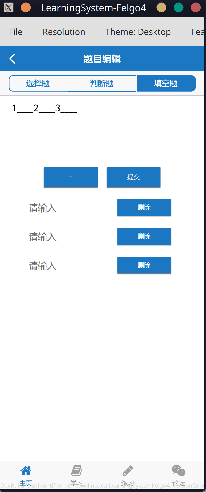
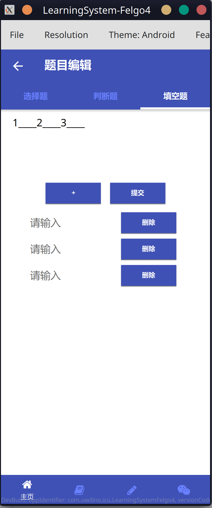
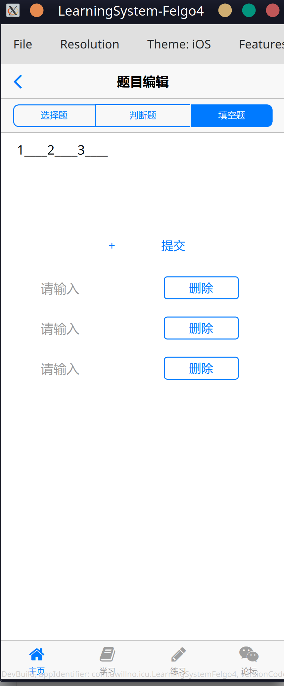

# 基于Android《大学计算机应用基础》学习系统APP（可跨平台）

## 说明

1. 该项目仅仅是软件工程的毕业设计，仅供学习参考。**工作量不适用于按天计算的课设。直接照搬到毕设，准备延毕。直接用来应付工作，准备辞职**。也不要找我帮忙答辩、汇报，~~就像我几天赶出来应付课设的快递管理系统，我自己都不清楚当时怎么瞎写的了~~。

2. 考虑到学习系统通常是需要跨平台的，而我也比较喜欢Qt框架，该系统是使用跨平台框架Qt进行开发的，也用到了Felgo SDK，**主要语言为C++、QML**，不是主流安卓应用开发方式，没有使用Java或者Kotlin。**如果你想找工作，不建议这样开发安卓应用，也不建议学安卓，更不建议学习Qt和Felgo**，~~尤其是在武汉这种地区，除非你想讨饭。~~

3. Qt、C++、Felgo都是自学的，有些部分还是边学边写，代码质量可能不太行或者不太规范，代码变化过大，中途还碰到了Felgo 3/Qt5/Qmake 到 Felgo 4/Qt6/Cmake的迁移。

5. 为什么用Felgo？省代码、QML热重载、有原生风格主题…

   

   

   

## 构建/部署

1. 该设计的开发环境与服务端部署系统均为Arch Linux，其中部分资源放在了Apache HTTP 服务器，故需要安装并配置Apache HTTP 服务器，可见[ArchWiki](https://wiki.archlinuxcn.org/wiki/Apache_HTTP_%E6%9C%8D%E5%8A%A1%E5%99%A8)。不同 Linux发行版安装命令和包命可能有所不同，配置文件应该差不多，但记得改配置文件为`DocumentRoot "/srv/http"` `<Directory "/srv/http">`，修改局域网IPv4地址`192.168.1.244`。
2. 如果换IP地址，需要同时替换源码和数据库表内某些字段中的值。SQL语句如下`update 表名  set 字段名=replace(字段名,'192.168.244','新IP地址');`。不建议换Apache HTTP的目录，因为需要改动的地方可能会比较多？
3. 建表，验收后会传`.sql`文件上来，也可以按照服务端的实体类的属性类型进行建表。
4. 服务器端一定要使用Qt6.4以上，`QHttpServer`是自从6.4以后官方才提供的，且此模块处于*“技术预览”*状态。之前Qt5时，服务端与客户端一直使用的`QTcpServer`和`QTcpSocket`进行数据传输，迁移到Qt6后，后期大多数功能都使用了`QHttpServer`，编码起来也更加方便。
5. 如果构建安卓应用，运行直接崩溃，报错有关`__emutls_get_address`，更换`NDK r23b`。

## 主要功能

功能验收/写毕业论文后再完善了...
