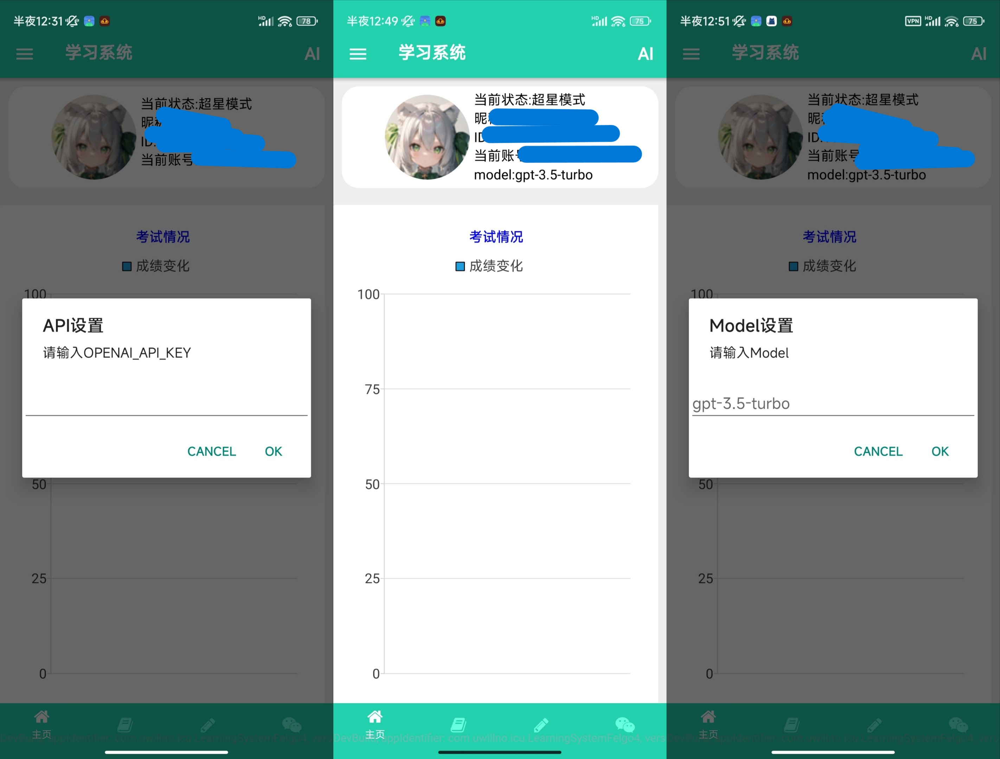
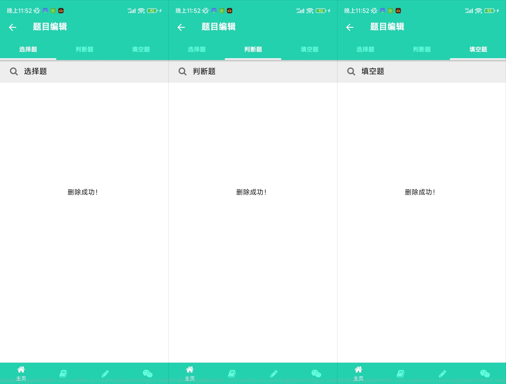

# 学习系统

## 说明

1. Linux见[旧README](README_Linux.md)，最近操作失误，回Windows了，顺便写Windows的readme。
2. 软件工程本科毕业设计，题目是基于Android《大学计算机应用基础》学习系统APP设计与实现，但是其实可以兼容其它平台的，仅供学习参考。
3. 服务端测试过Qt6.5 LTS，没有问题，不要用Felgo的6.4.1构建服务端。
4. 我的系统只有一个C盘，我不确定Windows下的根目录是怎么算的，有问题自己调代码的路径。
5. 不建议学Qt，~~也**不建议自己写本科毕设**~~，我纯粹是找不到工作，自学Qt写着玩。
6. 闲得慌也可以见[旧README](README_old.md)，~~废话更多~~，更详细。

## 构建/部署

1. 根目录创建`/srv/http`
2. 装好Apache服务器，修改`Apache/conf/httpd.conf`里`DocumentRoot "/srv/http"` `<Directory "/srv/http">`
3. 调IPv4地址`192.168.1.244`，不想调就调代码。
4. 创建`learning`数据库，运行`.sql`，**运行后不一定能直接用，先检查表。先将`post`表`text`为禁止删除的行的`id`改为0，再把`comment`表的`cxid`为1的行`id`改为0。**
5. 管理员登录明码是44910244，加密方式应该是`SHA256+Base64`。

## 主要功能

见[旧README](README_Linux.md)或者资源文件夹里的系统截图，最近就是换个色，优化下细节，修修Android平台上才出现的bug。

## 额外

1. **本科毕业设计本身就没多大意义，系统有现成的系统就直接用，别自己浪费时间，换个学习科目或换个平台这不又是一个新毕业设计，最后也就看个论文格式、查重，源码和程序都不会检查的，~~最多就演示几分钟，功能写多了根本来不及演示~~。**
2. 学校的事别太上心，~~上学阶段只是混个社会看重的文凭~~，想学还得自学。
3. 已知缺陷：删除时只删了数据库里的记录，没有删除静态资源服务器里的文件，有强迫症的可以补个完整的删除、文档学习安卓上不太好内部实现，其他平台上建议可以实现下、学习列表和刷题列表也可以加一个检索，~~作为毕设应该也没人会在意。~~

## 截图

这里的截图，如果查重会查图片，建议不要抄。

 

